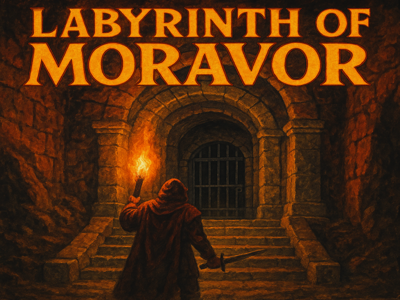

<p align="center">
  
</p>

# Labyrinth of Moravor

Labyrinth of Moravor is a modular, open-source dungeon crawler built with SDL2. Explore procedurally generated dungeons, battle monsters, collect treasure, and uncover the mysteries of Moravor. The engine is designed for extensibility and modding, making it easy to add new features, content, and mechanics.

## Features
- Procedurally generated labyrinths with increasing difficulty
- Turn-based combat system
- Diverse monsters and unique items
- Modular architecture for easy modding and expansion
- Pixel-art graphics and immersive soundtrack

## Getting Started

### Requirements
- C++17 or later
- SDL2 development libraries
- CMake 3.10+

### Build Instructions
```sh
mkdir build
cd build
cmake ..
make
./moravor
```

## Directory Structure
- `engine/`: Core engine (rendering, input, audio, tilemap)
- `game/`: Game logic (dungeon, combat, skills, turns, entities)
- `assets/`: Sprites, tilesets, maps
- `third_party/`: External dependencies (SDL2, stb, pugixml)
- `main.cpp`: Entry point
- `CMakeLists.txt`: Build system

## Contributing
Contributions are welcome! Feel free to submit issues, feature requests, or pull requests.

## License
This project is licensed under the MIT License.
